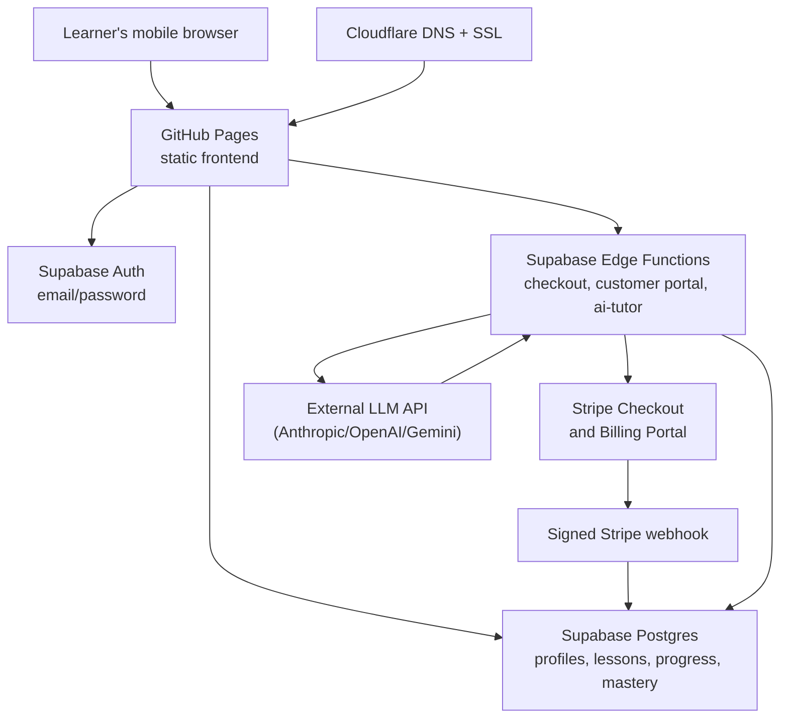

# Architecture

## System map

## Responsibility split

| Component | Responsibility | Must remain private? |
|---|---|---|
| GitHub Pages | Generated `dist/` copy of the `site/` static website | No |
| Cloudflare | Domain DNS, HTTPS and optional WAF/rate limiting | Account access only |
| Supabase Auth | Registration, confirmation and password recovery | Project administration only |
| Supabase Postgres | Learner profile, progress, lessons and access entitlement | Direct data access protected by RLS |
| Supabase Edge Functions | Create Checkout and Customer Portal sessions; handle webhooks; run the `ai-tutor` LLM tutor | Yes — has backend secrets |
| Stripe | Customer, subscription, invoice and payment events | Yes — account and key access |
| External LLM API | Generates Lia's tutoring replies for `ai-tutor`; never called from the browser | Yes — API key access |

## Access flow

1. A learner opens the website through the custom Cloudflare domain.
2. The learner creates an account or signs in through Supabase Auth.
3. The website reads only that learner's profile and entitlement through Supabase Row Level Security.
4. Without a current `trialing` or `active` entitlement, the website shows the £5 Checkout button.
5. The authenticated browser calls the trusted `create-checkout` function.
6. Stripe collects payment and creates the subscription with the agreed four-day schedule.
7. Stripe sends a signed webhook to Supabase. The webhook updates the learner entitlement.
8. The learner receives protected lessons only while the entitlement is active and has not expired.

## Why this architecture is safe for GitHub Pages

GitHub Pages hosts only static files. It cannot safely hold a Stripe restricted/secret key, so payment creation and webhook handling stay in Supabase Edge Functions. The browser has a Supabase **publishable** key by design; it does not give unrestricted database access when Row Level Security policies are correct.

## Failure boundaries

| If this fails | Customer experience | First place to check |
|---|---|---|
| GitHub Pages / Cloudflare | Website does not load | GitHub Actions run, Cloudflare DNS/SSL |
| Supabase Auth URL configuration | Confirmation link returns to the wrong address | Supabase Auth → URL Configuration |
| Checkout function | Customer cannot open Stripe Checkout | Supabase Edge Function logs and restricted key permissions |
| Stripe webhook | Payment succeeds but lessons stay locked | Stripe webhook delivery, signing secret and function logs |
| RLS policies | Data fails to load or is exposed | Supabase Database → Policies / Advisors |
